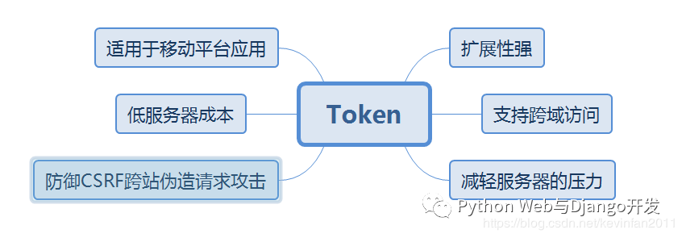
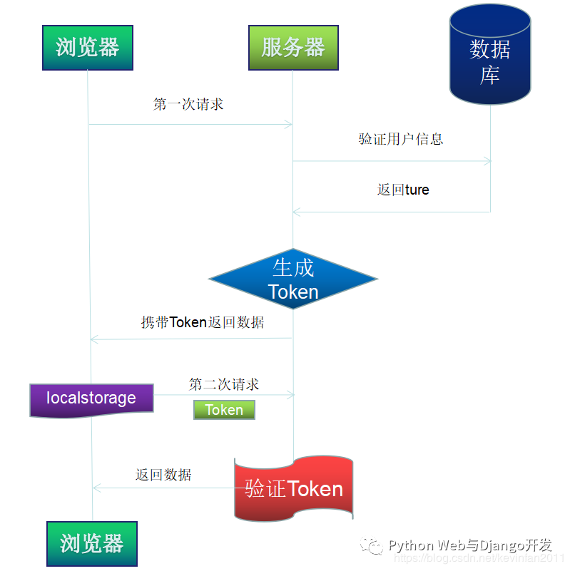

#JWT Token
一般Web应用开发验证用户信息有两种方式，一是使用session，二是使用token。
##JWT Token
```
Token字面意思是令牌，功能跟Session类似，也是用于验证用户信息的，Token是服务端生成的一串字符串，
当客户端发送登录请求时，服务器便会生成一个Token并将此Token返回给客户端，作为客户端进行请求的一
个标识以后客户端只需带上这个Token前来请求数据即可，无需再次带上用户名和密码。与session的不同之
处在于，Session是将用户信息存储在服务器中保持用户的请求状态，而Token在服务器端不需要存储用户的
登录记录，客户端每次向服务端发送请求的时候都会带上服务端发给的Token，服务端收到请求后去验证客户
端请求里面带着Token，如果验证成功，就向客户端返回请求的数据。
```



```angular2html
1.客户端使用用户名跟密码请求登录
2.服务端收到请求开始验证用户名与密码
3.验证成功后，服务端生成一个 Token并把这个 Token 发送给客户端
4.客户端收到 Token 以后可以把它存储起来，可以存放在 Cookie 里或者 Local Storage 里
5.客户端再次向服务端请求资形式源的时候携带服务端生成的 Token发送给服务器
6.服务端收到请求，然后去验证客户端请求里面携带的 Token，如果验证成功，就向客户端返回请求的数据，
否则拒绝请求。
```

###JWT Token的组成形式
```angular2html
JWT 标准的 Token 有三个部分：

header（头部）
每个 Token 里面都有一个 header，也就是头部数据，里面包含了使用的算法告诉我们这个token 是否加密。
如果是未加密的 Token ，这个属性可以设置成 none。

payload（数据）
Payload 里面是 Token 要包含的一些数据，内容可以自行定义，也可以参考标准字段（简写：全称）iss：
Issuer、sub：Subject、exp：Expiration time、iat：
Issued at。

signature（签名）
将Header和Playload使用Base64编码生成一下再加入签名字符用加密算法加密一遍，得到唯一的签名，用来防
止其他人来篡改Token中的信息。
```

###Django如何使用Token

即然我们知道Token的组成方式，那么我们就来创建下Token，首定义Header和Payload，header中定义token类
型和加密方式，Payload定义具体内容，如何用户名，发行时间，过期时间等。
```
headers={'type':'JWT','alg':'HS256'}
payloads={'iss':user,'iat':time.time()}
```
