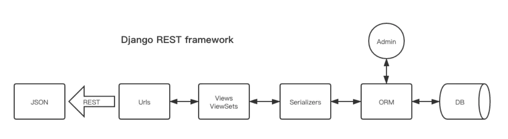

#序列化-Rustful


序列化过程
````
在Python的Django框架中，解释就很明显了。将ORM对象(queryset)等转化为JSON或者XML编码格式的数据。
反序列化与之相反。
restful，请求进来(经过视图层)，获取数据库中需要的数据，然后转为json格式，那样可以给前端，
或者其他程序调用。或者请求数据以JSON格式进来，转化为数据库能接收的形式，
存到数据库(反序列化)。
````

````
1.我们可以通过统一资源标识符（Universal Resource Identifier，URI）来识别和定位资源，
并且针对这些资源而执行的操作是通过 HTTP 规范定义的。其核心操作只有GET,POST,PUT,DELETE。
也就是：URL定位资源，用HTTP动词（GET,POST,DELETE,DETC）描述操作。
2.因此设计web接口的时候，REST主要是用于定义接口名，接口名一般是用名次写，不用动词，
那怎么表达“获取”或者“删除”或者“更新”这样的操作呢——用请求类型（GET,PUT,POST,DELETE）来区分。
````


##实现步骤
````
1.配置model
2.在serializers.py中配置model
3.创建视图
4.url路由配置
````


